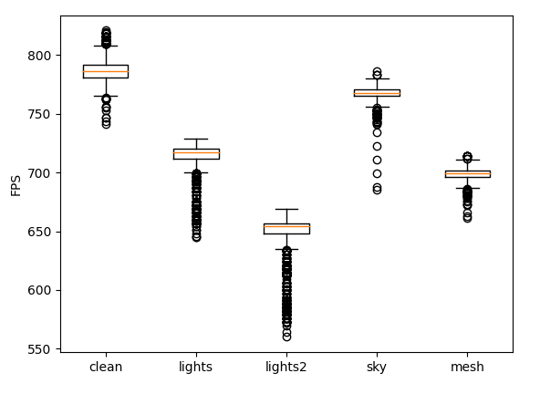
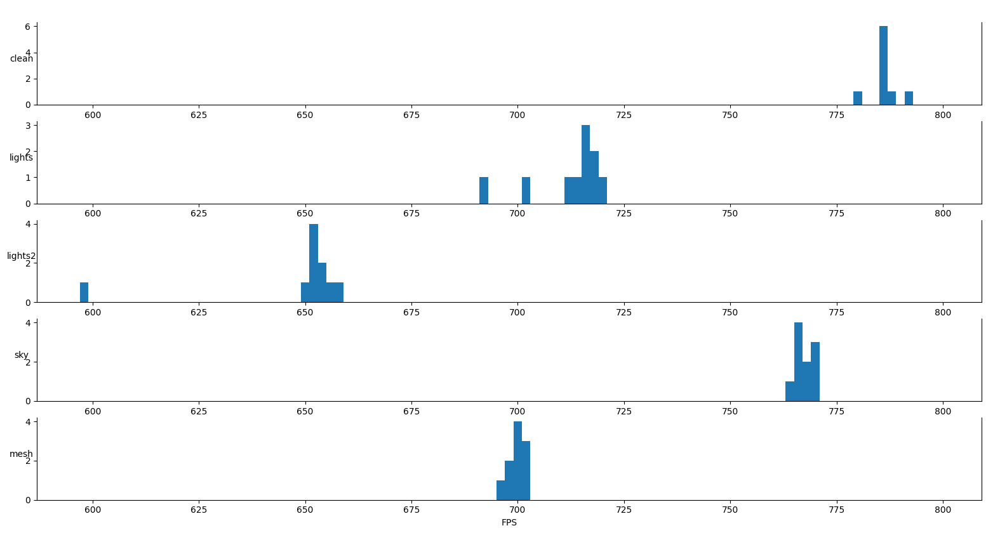
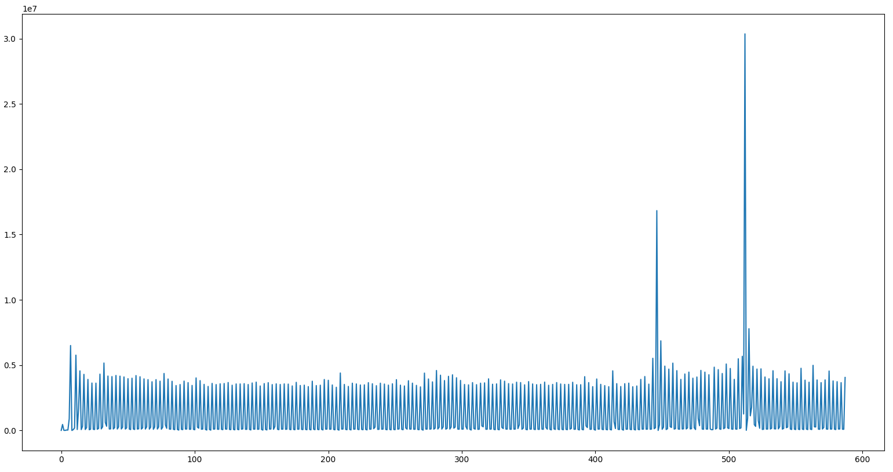

# Caiman Experimental Design and Goals

## Overview

Caiman is a language for constructing declarative heterogeneous memcopy operations, as described in the [associated design document](design.md).  The purpose of this document is to highlight the potential (very practical) performance benefits of allowing this sort of design space exploration, either from a user or compiler perspective.  More specifically, the objective of this document is to describe the existing experiments to establish the importance of CPU-GPU memcopy placement decisions in code and how the usual GPU driver optimizations are either unable or unwilling to perform these optimizations.

These experiments are intended to provide a reasonable coverage of a baseline set of simple optimizations in core WebGPU, as well as some intuition for coverage of a more complicated graphics library implementation on top of [WebGPU](https://github.com/gfx-rs/wgpu).  All experiments were written in Rust with WebGPU, and involved adapting the boilerplate of one of the afore-mentioned libraries.  In particular, each experiment involves either moving a memcopy around the control flow of the program or introducing additional memcopies.

It is worth noting that these experiments did not intend to optimize the existing code, but in fact intended to _deoptimize_ the code to some degree.  In particular, each experiment introduced some number of unneeded memcopies to demonstrate the importance of memcopy placement and minimizing calls.  As a result, experimental results are intended to show a _decrease_ in performance.

## Existing Experiments

The existing experiments are essentially divided into core WebGPU experiments and small graphics library experiments.  While the former were implemented off of the usual [WebGPU examples](https://github.com/gfx-rs/wgpu/tree/master/wgpu/examples), the latter were implemented as modifications on a [custom graphics library](https://github.com/cucapra/RasterizationWebGPU), originally implemented by [Andrei Shpilenok](https://github.com/ashpil).

### Core WebGPU Experiments

The core WebGPU experiments were primarily implemented based on the [simple cube shader](https://github.com/Checkmate50/wgpu-rs/tree/master/wgpu/examples/cube).  These experiments demonstrate the core deoptimization at play, namely moving memcopies around the control flow of the program and (more generally) introducing duplicate memcopies in the program logic.  For instance, the following code is used [in cube](https://github.com/Checkmate50/wgpu-rs/blob/master/wgpu/examples/cube/main.rs#L223):

```rs
let bind_group = device.create_bind_group(&wgpu::BindGroupDescriptor {
	...
});
```

In particular, this code is constructed in the initialization of state.  In our first deoptimized version, however, [we have the same code](https://github.com/Checkmate50/wgpu-rs/blob/master/wgpu/examples/cube2/main.rs#L328) _inside the render loop_:

```rs
fn render(
    ...
    ) {
        ...
            // Create bind group
            let bind_group = device.create_bind_group(&wgpu::BindGroupDescriptor {
				...
			});
	}
```

This relatively simple conceptual movement of code requires a reasonable amount of programmer effort, and for this example caused around a 5-10% loss in performance (as will be seen below).  Similar examples were explored with [duplicating bind groups](https://github.com/Checkmate50/wgpu-rs/blob/master/wgpu/examples/cube3/main.rs), [manipulating binding order](https://github.com/Checkmate50/wgpu-rs/blob/master/wgpu/examples/cube4/main.rs), and [using multiple cubes](https://github.com/Checkmate50/wgpu-rs/tree/master/wgpu/examples/multicube).  Careful timing has not been done on any of these experiments, but initial results are reported in "Results and Problems".

### Graphics Library Experiments

The main goal of extending these experiments to a larger graphics library is to show that the same issues occur in more complicated code (rather, in code of "sufficient complexity").  As with the WebGPU core experiments, these follow a simple pattern of moving memcopies around within the program, consequently introducing additional memcopies over the runtime of the program.

TODO: finish this section

## Results and Problems

The results of the experiments described above vary from quick measurements on the core WebGPU examples to more careful analysis of the simple graphics library examples.  Each of the results, and some problems with obtaining good results, will be described below.

The following table highlights the approximate slowdown of each experiment as _very initially_ measured as seconds per frame (SPF).  It is important to note that these results are by no means finalized or statistical, but are purely what I observed while fiddling with experiments.  Note that multicube had enough variance / is unfinished enough to have completely inconclusive results at the time of this writing.

| Experiment  | Slowdown    |
| :---        |    ----:    |
| Control     | 0%          |
| Cube2       | 5-10%       |
| Cube3       | 10-20%      |
| Cube4       | 5-10%       |
| Multicube   | ???%        |

It was mildly surprising to observe that similar percentage losses could be seen in the graphics library examples, despite the relatively complicated codebase.  In particular, these code examples demonstrated a consistent 10-20% loss in performance (depending on example) in **frames-per-second** compared to the control code for a simple scene.  More complicated scenes occured a similar overhead, though these results were not included here for simplicity.

The following box-and-whisker plot shows the FPS performance of the various experiments described above:



These results can be reasonably expected to be drawn from independent distributions -- in particular, multiple measurements should be expected to follow a roughly normal distribution pattern.  This assumption is important to allow the grouping of the results into a box-and-whisker plot (since each experiment was measured over several iterations).  To show that this appeared to hold true, the following histogram shows the distribution of means of each set of measurements within each experiment:



However, not all is well in the world of experimental measurements.  In particular, we observed some concerning oscillations when measuring the **seconds-per-frame** of these various experiments including, importantly, the core model.  There are many potential reasons for this, including possibly buffers of frames being accumulated, but further experimentation is necessary to narrow the cause down.  The oscillations described here are graphed below, where the x-axis is frame number and the y-axis is the SPF of that frame:



## Future Experimental Goals

Broadly, our future experimental goals can be summarized into three categories:

1) Extending existing optimization ideas
2) Exploring performance in medium-scale codebases
3) Examples written in Caiman itself

TODO: Finish a description of each