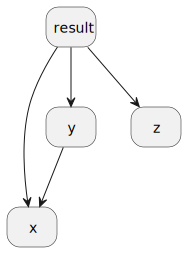
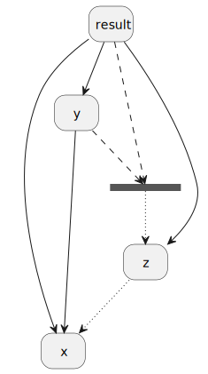
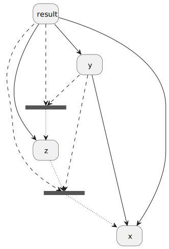
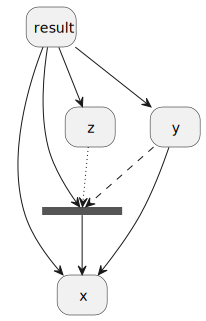
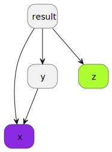

# Project

One of the main problems with the current notion of explication is that it's
extremely stupid.  Currently the approach is just to try and allocate and order
things in dependency order, which is naive enough to provide little control and
sometimes fail when explication should still be possible.  Connecting this up
with global information is specifically quite tricky.

Additionally, "naive explication" assumes that it will "put everything on the
CPU unless we literally have to put it on the GPU", which isn't very practical
beyond demonstrating that explication works.  I will examine this a bit more as
an extension.

While it would be possible to write a dependency analysis that is less dumb
within the explicator itself, ultimately it makes far more sense to leave this
sort of chain analysis to a proper solver.  SMT+Z3 makes a lot of sense for this
problem as stated (KMT is reasonable, but the toolset is less refined), as we
want a constructive solution rather than proven-correct program transformations.

## Example

The exact format of such a solver and result is hard to nail down (and arguably
part of the research end of the project).  However, the principle is somewhat
simple to illustrate when we treat the value language as a dependency graph.
For example, consider the following (simple) caiman program:

```
value foo() -> i64 {
    result := (+ (+ x y) z).
    x := 3.
    y := x + 2.
    z := 1.
    returns result.
}
```

The dependency graph here is fairly straightforward, where arrows to a node
indicate depending on that node:



The simplicity of the check here is essentially what "trivial explication"
relies on; all you need is that there are no cycles.  For the purpose of
illustration, what this might look like as a Z3 program is to encode nodes as
integers, the graph edges as comparisons, and then use the resulting model to
provide an order of operations.  For example, I hacked together this really
quick:

```
(declare-const x Int)
// declare other things
(assert (< x y))
(assert (< x result))
(assert (< y result))
(assert (< z result))
```

Which produces a reasonable first-pass solution:

```
result = 2
y = 1
z = 1
x = 0
```

# User-defined order

However, this is just doing what "naive explication" already does.  We want to
incorporate information on allocation location from the user.  Consider the
original program with the following incomplete user-provided schedule:

```
schedule foo_sch() -> slot {
    $x(?);
    $z(?);
    ???
}
```

Now we have an constraint that must hold, namely that `x` must be worked out
exactly before `z` (note that the lack of `???` between them matters!), and that
everything else happens after (I'm ignoring allocations for simplicity).

This logic is a bit harder to draw, but you could imagine something like this,
where the "box" indicates a place the compiler can freely allocate, a dashed
line indicates a timing dependency, and a dotted line indicates a "strict"
timing dependency:



Satisfiability is now a more interesting question, and one Z3 would help quite a
bit with.  In case it's not obvious why this isn't "just a check for cycles"
problem, consider the slightly-trickier user schedule, where the compiler is
allowed to insert operations between x and z:

```
schedule foo_sch() -> slot {
$x(?);
???
$z(?);
???
}
```

We would get a graph that looks something like:



And now it's not immediately clear if `y` should go in the first block or the
second, and if there's even a solution (if we preemptively put `result` in the
first block, then we don't have `z` yet and die).  This can get arbitrarily
silly of course.  Just cause diagrams are fun, consider an example of an
impossible schedule, where the user simply omits the last set of `???`:

```
schedule foo_sch() -> slot {
    $x(?);
    ???
    $z(?);
}
```

Then we get a timing something like the following:



# Heterogeneous Extension

Now, there is _also_ another problem to solve, and that is heterogeneity.
Consider a user schedule (where we are focused on the allocation location and
not order):

```
schedule foo_sch() -> slot {
    allocate-cpu $x;
    allocate-gpu $z;
    
    ???
}
```

This schedule essentially states that we want `x` on the cpu and `z` on the gpu,
with no additional context.  We can't change a decision made by the user, and so
we now have colors on our dependency graph (blue = CPU, green = GPU, grey =
unknown):



Now, there are still solutions to the dependencies, but using Z3 in this
situation gets a bit trickier.  In reality, this is an optimization problem --
an obvious heuristic to try would be to minimize the number of times we move a
variable, but in general we would want a cost model.

Without going into too much thought, we could use an [ILP
solver](https://en.wikipedia.org/wiki/Integer_programming) such as [Rust's
minilp](https://docs.rs/minilp/latest/minilp/), but I suspect this is overkill?
There are ways to get heuristic attempts at minimization out of Z3, which seem
more sensical as a first approach at least.  I'll writeup the plan assuming the
use of Z3, but that's less well-defined in my head, in short.

# Input Format

Ideally, having a tool that ingests the [assembly
AST](https://github.com/cucapra/caiman/blob/main/src/assembly_ast.rs) directly
would be easiest for me.  However, this AST is fairly complicated to unpack, and
it might make more sense to write a custom tree that can be ingested and
transformed to Z3.  I would not recommend taking in raw Caiman assembly, such is
a path to duplicate work madness and I suspect.

The alternative would be to write a custom mini-language, which might be helpful
to describe terms in the AST _anyway_, but is probably unnecessary cause parsers
are hard.  I'll propose a "dependency tree" that looks something like the
following (written in Rust for simplicity):

```rs
pub type VarName(String)
pub type FuncletName(String)

pub enum FuncletKind {
    Schedule, Timeline, Spatial
}

pub enum Variable {
    // Managing funclet name for reference
    pub funclet: FuncletName

    // List of variables this variable depends on
    pub dependencies: Vec<VarName>

    // 
}

pub struct ExplicatableFunclet {
    // What kind of funclet this is
    pub kind: FuncletKind,

    // The value funclet tied to this funclet
    pub value_name: FuncletName,

    // The map from variable names to more detailed information
    pub vars: HashMap<VarName, Variable>,
}

pub struct ValueFunclet {
    pub associated: Vec<FuncletName> // list of associated funclets
}

pub type ExplicatableFunclets = HashMap<FuncletName, ExplicatableFunclet>
pub type ValueFunclets = HashMap<FuncletName, ValueFunclet>

pub struct Program {
    pub explicatable_funclets: Funclets,
    pub value_funclets: ValueFunclets
}
```

This can totally be modified based on what's needed, but that might be the
majority of it in some sense.